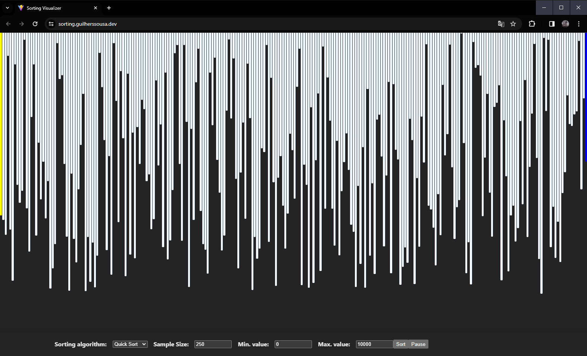

# Sorting Algorithm Visualizer

This project was build using only [Svelte](https://svelte.dev) and Generator functions for sorting.



## Setup

```bash
gh pr clone guilherssousa/sort-visualizer
pnpm install
pnpm dev
```

## Adding new algorithms

You can add new sorting algorithms on the [`src/lib/implementations.ts`](/src/lib/implementations.ts), using Generator Functions.
Also, please add a test in [`tests/sort.test.ts`](tests/sort.test.ts) to check if the
sort algo is working correctly.
